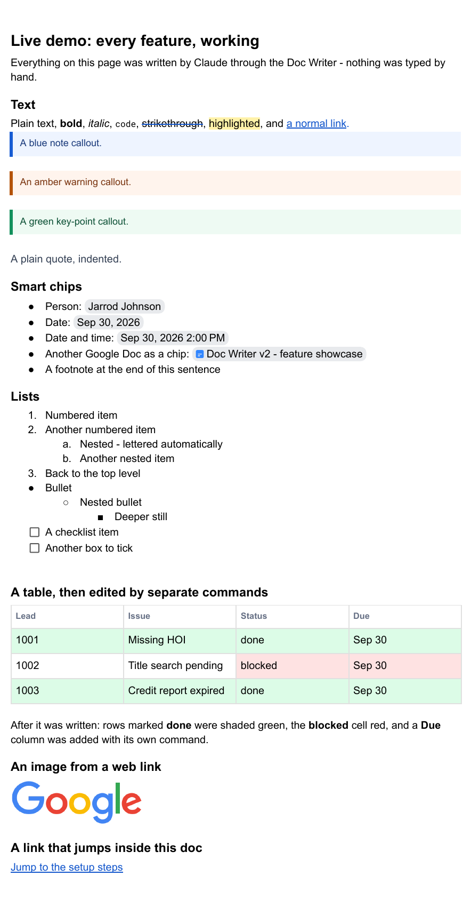

# claude-google-docs

**Let Claude edit your Google Docs directly. You don't need a Google Cloud project, an OAuth client or API keys, and you install it with one sentence.**

Tell Claude "add this bug to the QA log under Open Issues", "mark lead 1234 done and shade it green",
or "tag Sam as owner, due Sep 30", and it edits the doc. It changes only the part you asked about and
checks its work.

## Install

Open **Claude Code** on your Mac and say:

> **Install claude-google-docs from https://github.com/jarrodjohnson-gif/claude-google-docs**

Claude follows [INSTALL.md](INSTALL.md) and does the rest. You'll switch on one Google setting and click
**Allow** on two Google screens. It takes about 20 minutes, most of it waiting.

You need a Mac with Node.js and python3, and Claude Code (or the Claude desktop app).

## Why this one

Most Google Docs tools for AI ask you to create a Google Cloud project, configure an OAuth consent screen
and download client secrets. Many people give up at that step.

| | Typical Google Docs MCP servers | **claude-google-docs** |
|---|---|---|
| Google Cloud project | required | **not needed** |
| OAuth client / API keys | create and paste them | **not needed** |
| Admin approval at work | new OAuth apps are often blocked | runs as **your own** Apps Script |
| Install | several manual steps | **one sentence to Claude** |
| Smart chips (people, dates, files) | not advertised by the ones we checked | ✅ |
| Comments: read, reply, resolve | varies | ✅ |

It works by deploying a small **Google Apps Script** web app into your own Google account. The web app
runs as you, so it can edit any doc you can edit, and it has its own private key per install. Claude
calls it through a tiny CLI and skill.

## What it can do

| Area | You can ask for |
|---|---|
| **Writing** | add at the end, inside a section, or right after a line; replace or delete sections; find and replace (with a guard: "only if exactly 1 match") |
| **Lists** | real numbered, nested and checkbox lists |
| **Tables** | add, insert and delete rows and columns; edit a cell by row name and column name; colour-code rows; merge cells; set column widths |
| **Smart chips** | people `@[sam@x.com]`, dates `@date(2026-09-30 14:00)`, files `@file(<Drive link>)` |
| **Formatting** | bold, italic, ~~strike~~, ==highlight==, colour, size, font, links; restyle existing text |
| **Document** | the doc's heading styles, margins, page size, landscape, background, headers and footers, page breaks, footnotes, links that jump to a heading |
| **Tabs** | list, add, rename, delete (delete needs the exact title) |
| **Comments** | list, add, reply, resolve |
| **Templates** | copy a doc and fill in `{{placeholders}}`; copy a section from another doc with its formatting |
| **Images** | from Google Drive or a web link |
| **Batch** | many edits in one request |

Run `python3 gdoc.py -h` for every command.

## Safety

- **There's no "clear the doc" command.** Wiping a document needs an explicit confirmation the tools
  never send.
- **Guarded edits refuse instead of guessing.** Several matching tables, an unexpected match count or
  an ambiguous row all make it stop and say why.
- **Retries can't double-apply**, because every write carries an ID the script remembers.
- **Deleting a tab** requires its exact title.
- It only reaches docs **you** can already edit, and each install has its own token.

## Where it works

| | |
|---|---|
| Claude Code on macOS | ✅ via the skill |
| Claude desktop app (regular chats) | ✅ via the included MCP connector (`install_connector.sh`) |
| Cowork | ✅ |
| claude.ai in a browser, or the phone app | ❌ Claude has to run on your Mac |

## Limits

Google's APIs don't allow suggestion mode, comments anchored to a phrase, inserting a table of contents,
page numbers or pre-ticked checkboxes.

## Things Google's docs don't tell you

These came up while building it, and each one is handled:

- Docs' own markdown export fails on real documents.
- A new list item silently joins the list above it.
- Date chips with a time reject a time zone.
- Edits made from an in-doc menu can't be seen through the API until the menu action finishes.
- A new permission is only requested from a freshly reloaded script editor. Deploying never asks.

## Files

| File | What it is |
|---|---|
| `Code.gs`, `appsscript.json` | the Apps Script web app (goes into your Google account) |
| `gdoc.py` | the CLI Claude calls |
| `SKILL.md` | teaches Claude Code when and how to use it |
| `gdoc_mcp.py`, `install_connector.sh` | the optional connector for Claude desktop chats |
| `install.sh` | one-command install and update, using [clasp](https://github.com/google/clasp) (safe to re-run) |
| `INSTALL.md` | step-by-step install instructions written for Claude |

## License

MIT. Not affiliated with Google or Anthropic.
